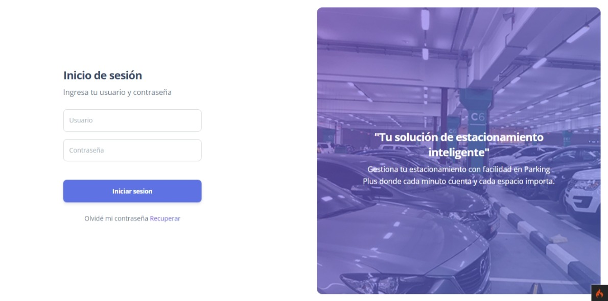

## **Parking Plus**


## Tabla de contenidos
- [**Parking Plus**](#parking-plus)
- [Tabla de contenidos](#tabla-de-contenidos)
- [Informacion general](#informacion-general)
- [Pre-requisitos](#pre-requisitos)
- [Capturas](#capturas)
- [Tecnologías](#tecnologías)
- [Instalación](#instalación)
- [Colaboración](#colaboración)
  - [¿Cómo puedes contribuir?](#cómo-puedes-contribuir)
- [Preguntas frecuentes](#preguntas-frecuentes)

## Informacion general
Parking Plus es una aplicación diseñada para facilitar la gestión eficiente y automatizada de estacionamientos, ofreciendo a los administradores y usuarios una experiencia intuitiva y sin problemas. El objetivo principal de este software es optimizar la gestión de estacionamientos, permitiendo a los usuarios supervisar y controlar el flujo de vehículos, brindar a los usuarios un medio conveniente para acceder y utilizar los servicios de estacionamiento.

## Pre-requisitos
Es necesario contar con ciertos requisitos para poder utilizar el sistema  
* PHP 8.1.6
* Composer
* Apache
* MySql
* Extensión PHP intl
* Extensión PHP mbstring

## Capturas



## Tecnologías
lista de tecnologias usadas en el proyecto:
* [CodeIgniter](https://codeigniter.com/): Version 4.4.5
* [PHP](https://www.php.net/releases/8_1_6.php): Version 8.1.6
* [Bootstrap](https://getbootstrap.com/): Version 5.0.2
* [Javascript](https://developer.mozilla.org/es/docs/Learn/JavaScript/First_steps/What_is_JavaScript)

## Instalación
Introducción a cerca de la instalación. 
```
$ git clone https://github.com/jesusSan1/parking-plus
$ cd ../path/to/the/file
$ composer install
$ cp env .env
$ php spark migrate
$ php spark db:seed 
$ php spark serve
```
Información adicional:  
para usar la aplicación en un entorno de ```desarrollo```, debe modificar el archivo ```.env``` para comenzar. Escribir lo siguiente:  
  
```
CI_ENVIRONMENT = development

app.baseURL = 'http://localhost:8080/'

database.default.hostname = localhost
database.default.database = parkingplus
database.default.username = tu_usuario
database.default.password = tu_contraseña
database.default.DBDriver = MySQLi
database.default.DBPrefix =
database.default.port = 3306

//Utilizar esta configuración en caso de querer utilizar un servidor SMTP para enviar emails
email.userAgent = 'CodeIgniter'
email.protocol = 'smtp'
email.mailPath = '/usr/sbin/sendmail'
email.SMTPHost = 'Tu_host'
email.SMTPUser = 'Tu_usuario'
email.SMTPPass = 'tu_contraseña'
email.SMTPPort = 'Tu_puerto'
email.SMTPTimeout = 15
email.SMTPKeepAlive = false
email.SMTPCrypto = 'tu_encriptación'
email.wordWrap = true
email.wrapChars = 76
email.mailType = 'html'
email.charset = 'UTF-8'
email.validate = false
email.priority = 3
email.CRLF = "\r\n"
email.newline = "\r\n"
email.BCCBatchMode = false
email.BCCBatchSize = 200
email.DSN = false
```

## Colaboración
Estamos emocionados de que estés considerando contribuir.
En este proyecto, creemos que la colaboración libre y abierta es fundamental para impulsar el progreso y la innovación. Todos los aportes, grandes o pequeños, son bienvenidos y valorados.

### ¿Cómo puedes contribuir?
1. **Desarrollo de código**: Si eres un desarrollador, puedes contribuir escribiendo código, mejorando características existentes, corrigiendo errores y proponiendo nuevas ideas.

2. **Pruebas**: Las pruebas son fundamentales para garantizar la estabilidad y la calidad del software. Puedes ayudar realizando pruebas exhaustivas y reportando problemas que encuentres.

3. **Documentación**: La documentación clara y concisa es esencial para que otros desarrolladores comprendan y utilicen nuestro software. Si tienes habilidades en escritura técnica, ¡tu ayuda será muy apreciada!

4. **Reporte de problemas**: Si encuentras algún error o tienes una idea para mejorar el software, por favor, abre un problema en nuestro repositorio. Tu retroalimentación es invaluable.

> La verdadera colaboración no se trata de sentir que todos están en el mismo barco, sino de reconocer que todos estamos en la misma tormenta.  


## Preguntas frecuentes
Una lista de preguntas frecuentes
1. **¿Cómo puedo instalar el software en mi sistema?**  
_Para instalar el software, simplemente sigue las instrucciones detalladas en nuestro archivo README.md en el repositorio del proyecto en GitHub._
2. __¿El software es gratuito?__  
Sí, Parking Plus es de código abierto y se distribuye bajo la licencia MIT. Puedes descargarlo, usarlo y modificarlo de acuerdo con los términos de la licencia.
3. **¿El software es compatible con dispositivos móviles?**  
*Sí, Parking Plus es compatible con dispositivos móviles que admiten navegadores web modernos.*.

| Pregunta                                                                   | Respuesta                                                                                                                              |
| -------------------------------------------------------------------------- | --------------------------------------------------------------------------------------------------------------------
| ¿Cuál es el lenguaje de programación principal utilizado en el desarrollo? | Parking Plus está principalmente desarrollado en PHP.
| ¿El software incluye funcionalidades de seguridad?                         | Sí, la seguridad es una prioridad. Parking Plus incluye funciones de seguridad para proteger los datos y la privacidad de los usuarios. |